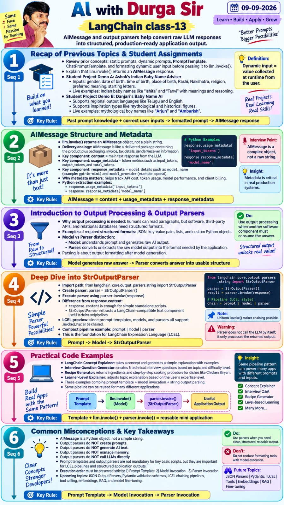
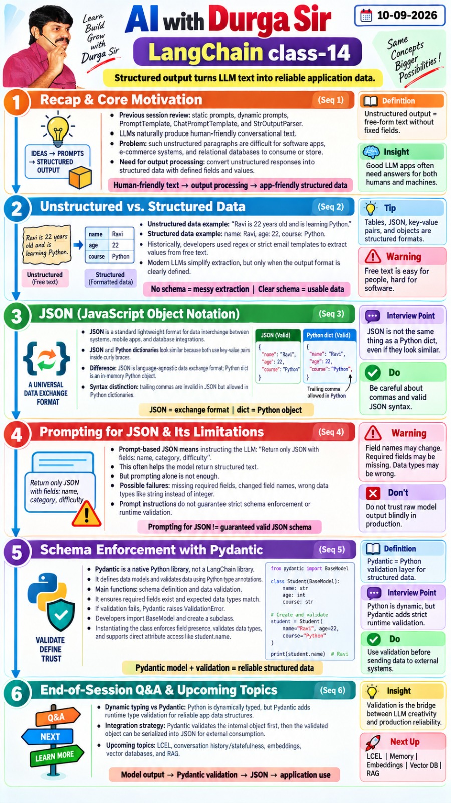

# Output parsers and structured data

## Message content and parsing

A chat model returns an `AIMessage`, which contains text and metadata. For a simple display, use `.content`. A parser is useful when a chain should return a specific data shape. `StrOutputParser` converts a model response into text and fits into `prompt | model | parser`. Run [string_output_parser.py](programs/string_output_parser.py) for a no-network parser demonstration.

## JSON, schemas, and Pydantic

Requesting JSON in a prompt alone cannot ensure fields and types are correct. A Pydantic `BaseModel` describes fields, required or optional values, and validation rules. `model_dump()` yields a Python dictionary; `model_dump_json()` yields JSON text. Run [pydantic_schema.py](programs/pydantic_schema.py) without an API key.

## Structured model output

`model.with_structured_output(Student)` wraps the chat model so an invocation returns a parsed `Student` object. Run [structured_student_extractor.py](programs/structured_student_extractor.py) for a live extraction example. Make uncertain fields optional, describe fields clearly, and inspect the result before downstream actions. A valid schema confirms shape and types; it does not prove every extracted fact is true.

Class 17 explains the wrapper and `include_raw=True`, which exposes raw response, parsed result, and parsing error for debugging. Class 18 emphasizes good field names, descriptions, types, and optional fields. Use specific exception handling around external calls and validation.

## Source material

- [Classes 13–15](../sources/pdfs/class13-langchain.pdf), [class 16](../sources/pdfs/class16-notes.pdf), [class 18](../sources/pdfs/Langchain%20-%20class18.pdf)
- [Output parser and structured output notes](../sources/pdfs/Langchain-%20Output%20parsers%20%26%20Struc%20op%20notes.pdf)
- [Class 17 image](../sources/images/class%2017.png), [class 18 image](../sources/images/class%2018.png)
