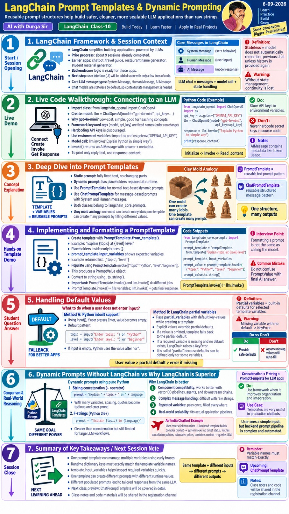
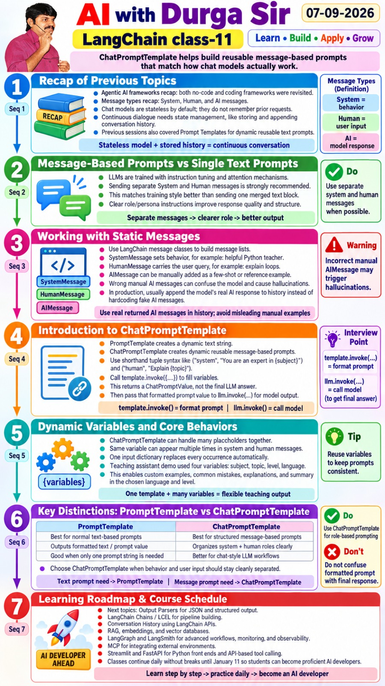
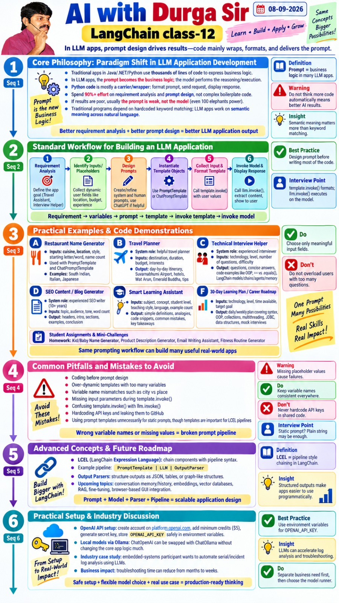

# Prompts and message templates

## Static versus dynamic prompts

A static prompt is fixed text. A dynamic prompt contains placeholders such as `{topic}` and `{level}`. `PromptTemplate` fills those placeholders and produces a prompt value; it does **not** call a model. Run [prompt_template.py](programs/prompt_template.py) without an API key.

`template.invoke({"topic": "Python"})` formats the prompt. `model.invoke(prompt_value)` then calls the model. Variable names in the input dictionary must match placeholders exactly. Defaults can be supplied in ordinary Python or through partial variables.

Run [prompt_defaults.py](programs/prompt_defaults.py) to compare the two ways to provide defaults and see how an explicit value overrides a partial variable.

## Chat prompts

`ChatPromptTemplate` builds a sequence of messages, normally keeping system instructions separate from user input. The same placeholder may occur in more than one message. Run [chat_prompt_template.py](programs/chat_prompt_template.py) to see the formatted messages.

## From requirements to an application

1. Decide what the application should produce.
2. Identify only the user inputs needed.
3. Write the prompt and create a template.
4. Fill the template with user values.
5. Invoke the model and display `response.content`.

The [restaurant name generator](programs/restaurant_names.py) follows this flow and makes a live API call. Avoid hardcoded keys and keep placeholder names consistent.

The same workflow supports a [travel planner](programs/travel_planner.py) and [technical interview helper](programs/interview_helper.py). Both use separate system and human messages, validate their inputs, and need an API key. They are practice programs based on the class 12 application ideas; generated travel prices and availability need independent checking.

## Source material

- [Classes 8–9](../sources/pdfs/class8-langchain.pdf), [class 10](../sources/pdfs/class10-langchain.pdf), [class 11](../sources/pdfs/class11-langchain.pdf), [class 12](../sources/pdfs/class12-langchain.pdf)
- [Detailed prompt template notes](../sources/pdfs/Langchain%20-%20prompt%20templates.pdf)
